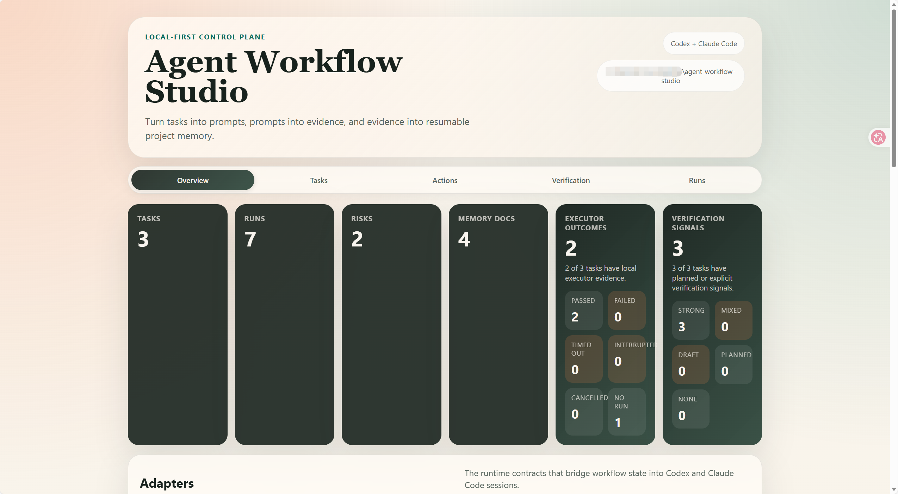

# Agent Workflow Studio

<p align="center">
  <a href="https://www.npmjs.com/package/agent-workflow-studio"></a>
  <a href="https://github.com/SJW1111011/agent-workflow-studio/actions/workflows/ci.yml"></a>
  <a href="LICENSE"></a>
  <a href="https://nodejs.org"></a>
  
</p>

> **Built entirely by Codex in a single session (default 258k context), with Claude Code providing evaluation, suggestions, and code review.**
> This project is both the tool and the proof that structured agent workflows work.

Make every Codex and Claude Code run leave an auditable evidence trail.

Zero dependencies - local-first - Git-native - npm-installable

Agent Workflow Studio turns:

- tasks into strong prompts
- runs into evidence
- evidence into refreshed docs and checkpoints
- long jobs into resumable handoffs instead of lost context

## How it works

A local-first workflow loop for turning messy agent sessions into bundled tasks, auditable evidence, and durable checkpoints.

<p align="center">
  
</p>

## Try it in 1 minute

```bash
npm install agent-workflow-studio
npx agent-workflow init --root .
npx agent-workflow quick "My first task" --task-id T-001 --agent codex --root .
npx agent-workflow dashboard --root . --port 4173
```

Then open `http://localhost:4173`.

For the cleaner helper-directory install flow, see [docs/GETTING_STARTED.md](docs/GETTING_STARTED.md).

## See the dashboard

Track tasks, runs, risks, executor outcomes, and verification signals from one local control plane.

<p align="center">
  
</p>

## Core capabilities

- **`quick`** - create a durable task bundle in one step: profile refresh, task docs, prompt, run request, launch pack, and checkpoint
- **`memory:bootstrap`** - generate a local-only handoff prompt that helps Codex or Claude Code fill grounded project memory
- **`run:execute`** - launch a local adapter when you explicitly opt into `commandMode: exec`, with shared preflight, logs, and evidence capture
- **`verification gate`** - compare repo-relative task scope against the current repository snapshot and show which scoped files still need explicit proof
- **`proof anchors`** - keep passed evidence and refreshed manual proof tied to content fingerprints, not fragile `mtime` alone
- **`skills:generate`** - write `AGENTS.md`, `CLAUDE.md`, and Claude slash commands so the workflow becomes part of the agent's default context
- **`dashboard`** - inspect tasks, evidence, freshness, risks, execution state, and quick-create flows from a local control plane at `localhost:4173`

## Built for agents too

Teach Codex and Claude Code the workflow automatically:

```bash
npx agent-workflow skills:generate --root .
```

This writes `AGENTS.md`, `CLAUDE.md`, and Claude slash commands so the agent can follow the same task/evidence/checkpoint flow without manual setup.

See [AGENT_GUIDE.md](AGENT_GUIDE.md) for the full workflow guide.

## Architecture at a glance

```text
Task creation          Agent execution           Evidence + resume
     |                       |                         |
     v                       v                         v
+-------------------------------------------------------------------+
|                        .agent-workflow/                           |
|                                                                   |
|  memory/            tasks/T-001/                 adapters/         |
|  - product.md       - task.md                    - codex.json      |
|  - architecture.md  - context.md                 - claude-code.json|
|  - rules.md         - verification.md            - custom *.json   |
|                      - prompt.codex.md                              |
|                      - run-request.codex.json                       |
|                      - launch.codex.md                              |
|                      - checkpoint.md                                |
|                      - runs/ evidence + proof anchors               |
+-------------------------------------------------------------------+
         |                                         |
         v                                         v
   Git-trackable repo                        Dashboard / CLI
```

## Daily workflow

1. Create a task with `quick` or `task:new`.
2. Hand the compiled prompt to Codex or Claude Code, or use `run:execute` when a local adapter is ready.
3. Review proof in `verification.md` and recorded runs under `.agent-workflow/tasks/<taskId>/runs/`.
4. Refresh `checkpoint.md`, keep moving, and resume later without losing context.

## Verification model

Two ideas sit at the center of the project:

- **Verification gate**: compare repo-relative task scope against the current repository snapshot (Git-backed when available, filesystem fallback otherwise) and explain which scoped files still need explicit proof.
- **Proof anchor**: persist content fingerprints with passed run evidence and refreshed manual proof, so freshness survives misleading `mtime` churn, branch switches, and agent handoff noise. Strong proof requires `paths + checks or artifacts`; path-only proof stays weak.

## Why this exists

Most teams using coding agents still lack:

- stable project memory
- structured task context
- trustworthy verification state
- resumable checkpoints
- a shared control plane across Codex and Claude Code

Agent Workflow Studio is designed to become that missing layer.

## Commands

- **Onboarding:** `init`, `scan`, `memory:bootstrap`, `memory:validate`
- **Tasking:** `recipe:list`, `quick`, `task:new`, `task:list`
- **Adapters:** `adapter:list`, `adapter:create`
- **Execution:** `prompt:compile`, `run:prepare`, `run:execute`, `run:add`, `checkpoint`
- **Inspection:** `dashboard`, `validate`
- **Skills:** `skills:generate`

## Adapter layer

Adapters bridge the workflow layer and real agent CLIs.

- Built-in Codex and Claude Code adapters ship as `manual` by default
- Switch to `commandMode: exec` when you are ready to automate local runs
- `adapter:create` scaffolds a custom adapter for any CLI agent
- `stdinMode: promptFile` lets non-interactive CLIs receive prompts over stdin
- Execution captures stdout/stderr, timeout, interruption, and cancellation metadata
- Shared preflight checks verify runner availability, env vars, and stdio compatibility before spawn

Both Codex and Claude Code have been dogfooded on this repository with real local runs. See [docs/ADAPTERS.md](docs/ADAPTERS.md) for the full adapter contract and [docs/RUN_EXECUTE_DESIGN.md](docs/RUN_EXECUTE_DESIGN.md) for the executor design.

## Recipes and schema validation

- Recipes (`audit`, `feature`, `review`) are indexed in `.agent-workflow/recipes/index.json` and attached to tasks via `recipeId`
- `validate` checks project config, adapters, tasks, and run records for missing or malformed fields
- The dashboard surfaces schema issues, memory freshness, and verification gate status in one view

See [docs/RECIPES_AND_SCHEMA.md](docs/RECIPES_AND_SCHEMA.md).

## Relocatable by design

No absolute paths are written into workflow files. The CLI and dashboard resolve the target repository from `--root` or the current working directory. See [docs/RELOCATABLE_DESIGN.md](docs/RELOCATABLE_DESIGN.md).

## Layout

```text
agent-workflow-studio/
  src/           CLI + core modules
  dashboard/     static frontend (zero build step)
  docs/          design docs and guides
  scripts/       smoke test + unit test runner
  test/          unit tests
```

Initialized target repository:

```text
.agent-workflow/
  project.json
  project-profile.json / .md
  memory/        product, architecture, domain-rules, runbook
  recipes/       audit, feature, review + index.json
  adapters/      codex.json, claude-code.json, custom *.json
  tasks/         T-001/, T-002/, ...
  handoffs/      memory-bootstrap.md
  decisions/
```

## Contributor workflow

From this project root:

```bash
npm run init -- --root ../some-repo
npm run scan -- --root ../some-repo
npm run memory:bootstrap -- --root ../some-repo
npm run quick -- "Build the scanner" --task-id T-001 --priority P1 --agent codex --root ../some-repo
npm run dashboard -- --root ../some-repo --port 4173
npm run run:execute -- T-001 --agent codex --root ../some-repo
npm run run:add -- T-001 "Scanner pass completed." --status passed --root ../some-repo
npm run checkpoint -- T-001 --root ../some-repo
npm run validate -- --root ../some-repo
npm test
```

## Learn more

- [Getting Started](docs/GETTING_STARTED.md) - the full npm-first onboarding flow
- [Documentation Index](docs/README.md) - the map for all design and reference docs
- [Architecture](docs/ARCHITECTURE.md) - how the scaffold, dashboard, adapters, and evidence model fit together
- [Verification Design](docs/VERIFICATION_FRESHNESS_DESIGN.md) - verification gates, proof anchors, and freshness rules
- [Executor Design](docs/RUN_EXECUTE_DESIGN.md) - local executor planning, preflight, and evidence capture
- [Adapters](docs/ADAPTERS.md) - built-in adapters and custom adapter scaffolding
- [Roadmap](docs/ROADMAP.md) - the likely next build steps
- [Publishing](docs/PUBLISHING.md) - npm release checklist

## Contributing

Read [CONTRIBUTING.md](CONTRIBUTING.md). Keep changes local-first, relocatable, and schema-aware. Run `npm test` and `npm run smoke` before opening a PR.

## Community

[CODE_OF_CONDUCT.md](CODE_OF_CONDUCT.md) defines how we collaborate. Issues and PRs should stay focused on strong prompts, evidence quality, checkpoints, and agent handoff durability.

## License

Released under the MIT License. See [LICENSE](LICENSE).
